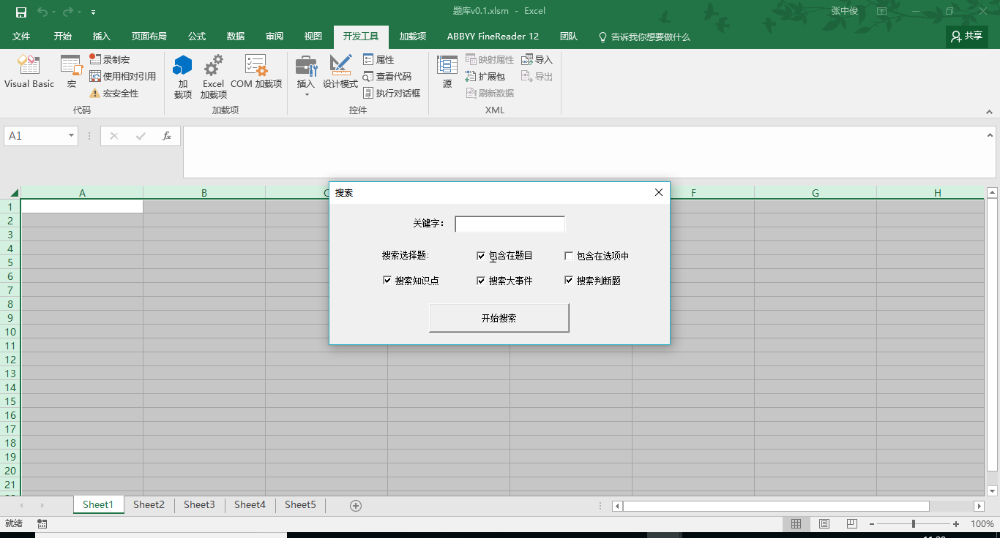

# 西电往年学生的作品

在百度网盘中，github_MiMaXueJingSai

# 密码学竞赛的题库
使用VBA的技术，将题库整合在了一起，做成了一个excel的形式，方便查询
题库中的题目包括：
1. 判断题
2. 知识点
3. 大事件
4. 单选和多选

## 运行截图

## 核心代码
```vba
Dim sheet1 As Worksheet
Dim sheet2 As Worksheet
Dim sheet3 As Worksheet
Dim sheet4 As Worksheet
Dim sheet5 As Worksheet

Private Sub Label1_Click()

End Sub

Private Sub TextBox1_KeyDown(ByVal KeyCode As MSForms.ReturnInteger, ByVal Shift As Integer)
    If KeyCode = 13 Then
        CommandButton1_Click
    End If
End Sub

Private Sub UserForm_Click()
TextBox1.Text = ""
End Sub

Rem 完成初始化的工作
Private Sub UserForm_Initialize()
    CheckBox1.Value = True
    CheckBox2.Value = False
    CheckBox3.Value = True
    CheckBox4.Value = True
    CheckBox5.Value = True
    Set sheet1 = Application.Workbooks("题库v0.1.xlsm").Worksheets("Sheet1")
    Set sheet2 = Application.Workbooks("题库v0.1.xlsm").Worksheets("Sheet2")
    Set sheet3 = Application.Workbooks("题库v0.1.xlsm").Worksheets("Sheet3")
    Set sheet4 = Application.Workbooks("题库v0.1.xlsm").Worksheets("sheet4")
    Set sheet5 = Application.Workbooks("题库v0.1.xlsm").Worksheets("sheet5")
End Sub

Rem 点击按钮之后 1.获取关键字 2.获取选择框中的内容 3.清除sheet1中的所有内容
Private Sub CommandButton1_Click()
    sheet1.Cells.Clear
    keyword = TextBox1.Text
    keyword = Trim(keyword)
    If Len(keyword) = 0 Then
        Exit Sub
    End If
    c1 = CheckBox1.Value
    c2 = CheckBox2.Value
    c3 = CheckBox3.Value
    c4 = CheckBox4.Value
    c5 = CheckBox5.Value
    sheet1RowIndex = 1
    If c1 Or c2 Then
        sheet1RowIndex = findTiMuAndDaAn(keyword, c1, c2)
    End If
    Rem MsgBox (sheet1RowIndex)
    If c3 Then
        sheet1RowIndex = findZhiShi(sheet1RowIndex, keyword)
    End If
    Rem MsgBox (sheet1RowIndex)
    If c4 Then
        sheet1RowIndex = findDaShiJian(sheet1RowIndex, keyword)
    End If
    Rem MsgBox (sheet1RowIndex)
    If c5 Then
        Call findPanDuanTi(sheet1RowIndex, keyword)
    End If
    Rem MsgBox (sheet1RowIndex)
    Rem 添加红色
    addRedFont (keyword)
    Rem 设置自动换行
    sheet1.Cells.Select
    With Selection
        .HorizontalAlignment = xlGeneral
        .VerticalAlignment = xlCenter
        .WrapText = True
        .Orientation = 0
        .AddIndent = False
        .IndentLevel = 0
        .ShrinkToFit = False
        .ReadingOrder = xlContext
        .MergeCells = False
    End With
End Sub
Rem 寻找多选题中的关键词 keyword:关键词 c1:是否在题目中寻找 c2:是否在选项中寻找
Function findTiMuAndDaAn(keyword, c1, c2) As Integer
    sheet1RowIndex = 1
    sheet2RowIndex = 1
    Do While True
        If IsEmpty(sheet2.Cells(sheet2RowIndex, 1)) Then
            Exit Do
        End If
        t1 = (InStr(UCase(sheet2.Cells(sheet2RowIndex, 1)), UCase(keyword)) <> 0)
        t2 = (InStr(UCase(sheet2.Cells(sheet2RowIndex, 2)), UCase(keyword)) <> 0)
        t3 = (InStr(UCase(sheet2.Cells(sheet2RowIndex, 3)), UCase(keyword)) <> 0)
        t4 = (InStr(UCase(sheet2.Cells(sheet2RowIndex, 4)), UCase(keyword)) <> 0)
        t5 = (InStr(UCase(sheet2.Cells(sheet2RowIndex, 5)), UCase(keyword)) <> 0)
        If (t1 And c1) Or (t2 And c2) Or (t3 And c2) Or (t4 And t2) Or (t5 And t2) Then
            sheet1.Cells(sheet1RowIndex, 1) = sheet2.Cells(sheet2RowIndex, 1)
            sheet1.Cells(sheet1RowIndex, 2) = sheet2.Cells(sheet2RowIndex, 2)
            sheet1.Cells(sheet1RowIndex, 3) = sheet2.Cells(sheet2RowIndex, 3)
            sheet1.Cells(sheet1RowIndex, 4) = sheet2.Cells(sheet2RowIndex, 4)
            sheet1.Cells(sheet1RowIndex, 5) = sheet2.Cells(sheet2RowIndex, 5)
            sheet1.Cells(sheet1RowIndex, 6) = sheet2.Cells(sheet2RowIndex, 6)
            
            sheet1RowIndex = sheet1RowIndex + 1
        End If
        sheet2RowIndex = sheet2RowIndex + 1
    Loop
    findTiMuAndDaAn = sheet1RowIndex
End Function


Rem 寻找多选题中的关键词 keyword:关键词 c1:是否在题目中寻找 c2:是否在选项中寻找
Function findZhiShi(sheet1RowIndex, keyword) As Integer
    sheet3RowIndex = 1
    Rem 对于sheet3的每一行
    Do While True
        If IsEmpty(sheet3.Cells(sheet3RowIndex, 1)) Then
            Exit Do
        End If
        Rem 循环1：对于sheet3的每一列
        sheet3ColIndex = 1
        Do While True
            If IsEmpty(sheet3.Cells(sheet3RowIndex, sheet3ColIndex)) Then
                Rem 如果这一行没有内容了，就退出循环1
                Exit Do
            End If
            If InStr(UCase(sheet3.Cells(sheet3RowIndex, sheet3ColIndex)), UCase(keyword)) <> 0 Then
                sheet3ColIndex = 1
                Rem 循环2 开始复制
                Do While True:
                    If IsEmpty(sheet3.Cells(sheet3RowIndex, sheet3ColIndex)) Then
                        Rem 如果这一行没有内容了 就退出循环2
                        Exit Do
                    End If
                    sheet1.Cells(sheet1RowIndex, sheet3ColIndex) = sheet3.Cells(sheet3RowIndex, sheet3ColIndex)
                    sheet3ColIndex = sheet3ColIndex + 1
                Loop
                sheet1RowIndex = sheet1RowIndex + 1
                Rem 既然已经确认该行有关键词了，退出循环1
                Exit Do
            End If
            sheet3ColIndex = sheet3ColIndex + 1
        Loop
        sheet3RowIndex = sheet3RowIndex + 1
    Loop
    findZhiShi = sheet1RowIndex
End Function

Function findDaShiJian(sheet1RowIndex, keyword) As Integer
    sheet4RowIndex = 1
    Do While True
        If IsEmpty(sheet4.Cells(sheet4RowIndex, 1)) Then
            Exit Do
        End If
        If InStr(UCase(sheet4.Cells(sheet4RowIndex, 1)), UCase(keyword)) <> 0 Then
            sheet1.Cells(sheet1RowIndex, 1) = sheet4.Cells(sheet4RowIndex, 1)
            sheet1RowIndex = sheet1RowIndex + 1
        End If
        sheet4RowIndex = sheet4RowIndex + 1
    Loop
    findDaShiJian = sheet1RowIndex
End Function

Sub findPanDuanTi(sheet1RowIndex, keyword)
    sheet5RowIndex = 1
    Do While True
        If IsEmpty(sheet5.Cells(sheet5RowIndex, 1)) Then
            Exit Do
        End If
        If InStr(UCase(sheet5.Cells(sheet5RowIndex, 1)), UCase(keyword)) <> 0 Then
            sheet1.Cells(sheet1RowIndex, 1) = sheet5.Cells(sheet5RowIndex, 1)
            sheet1.Cells(sheet1RowIndex, 2) = sheet5.Cells(sheet5RowIndex, 2)
            sheet1RowIndex = sheet1RowIndex + 1
        End If
        sheet5RowIndex = sheet5RowIndex + 1
    Loop
End Sub

Rem 将sheet1中的内容加上红色字体
Sub addRedFont(keyword)
    Row = 1
    Rem 对每一行
    Do While True
        Col = 1
        Rem 对每一列
        Do While True
            If IsEmpty(sheet1.Cells(Row, Col)) Then
                Exit Do
            End If
            If InStr(UCase(sheet1.Cells(Row, Col)), UCase(keyword)) <> 0 Then
                sheet1.Cells(Row, Col).Characters(Start:=InStr(UCase(sheet1.Cells(Row, Col)), UCase(keyword)), Length:=Len(keyword)).Font.Color = vbRed
            End If
            Col = Col + 1
        Loop
        Row = Row + 1
        If IsEmpty(sheet1.Cells(Row, 1)) Then
            Exit Do
        End If
    Loop
    
End Sub
```
